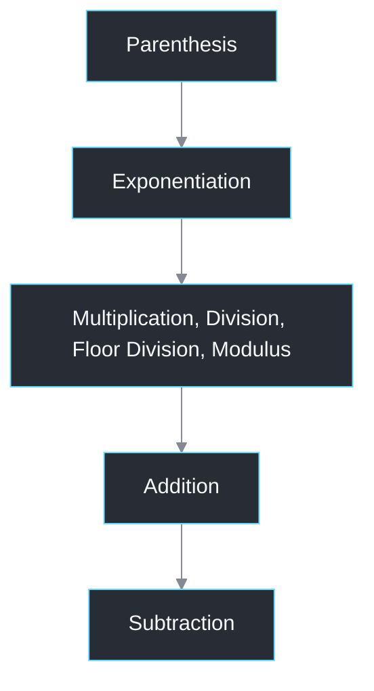

# Python

Python is a dynamically typed, high-level programming language known for its simple syntax and versatility.

## Variables

Variables are dynamically typed. Think of them as tagging labels to objects.

```python
num_zero = 0
print(num_zero, type(num_zero)) # 0 <class 'int'>

str_zero = "0"
print(str_zero, type(str_zero)) # 0 <class 'str'>
```

You can assign multiple variables in a single line.

```python
num_zero, num_one = 0, 1
print(num_zero, num_one) # 0 1

str_zero, num_one, list_two = "0", 1, [2]
print(str_zero, num_one, list_two) # 0 1 [2]
```

You can swap the values of two variables using Pythonic swap.

```python
num_zero, word_zero = 0, "zero"
print(num_zero, word_zero) # 0 zero

num_zero, word_zero = word_zero, num_zero
print(num_zero, word_zero) # zero 0
```

Increment and decrement the values of the variables as below.

```python
num_one = 0
num_one += 1
print(num_one) # 1

num_zero = 1
num_zero -= 1
print(num_zero) # 0
```

If a variable is assigned as `None`, it means that there is no value (null) inside it.

```python
none = None
print(none) # None
```

## Conditional Statements

Parentheses are optional in general but necessary for multi-line conditions.

```python
my_pet = "dog"

if (my_pet == "cat"):
    print(f"I have a black {my_pet}")
elif my_pet == "dog":
    print(f"What da {my_pet} doin") # What da dog doin
else:
    print(f"My pet is a {my_pet}")

pandemic_year = 2020
if pandemic_year % 400 == 0 or (pandemic_year % 4 == 0 and pandemic_year % 100 != 0):
    print(f"{pandemic_year} is a Leap Year") # 2020 is a Leap Year
else:
    print(f"{pandemic_year} is a Cheap Year")
```

## Loops

Loops are used to repeat a block of code.

### While loop

Syntax: `while [<condition>]`

```python
num_zero = 3

while num_zero > 0:
    print(num_zero) # 3, 2, 1
    num_zero -= 1

print(num_zero) # 0
```

### For loop

Syntax: `for var in range([<start>], <stop>, [<step>]):`

```python
for num in range(6):
    print(num) # 0, 1, 2, 3, 4, 5

for num in range(1, 6):
    print(num) # 1, 2, 3, 4, 5

for num in range(5, 0, -1):
    print(num) # 5, 4, 3, 2, 1
```

### enumerate

Syntax: `for index, value in enumerate(<iterable_object>, [<start = index_start_value>]):`

```python
numbers = [10, 20, 30, 40]

for idx, val in enumerate(numbers):
    print(idx, val) # 0 10, 1 20, 2 30, 3 40
```

### zip

Syntax: `for item_1, ... item_n in zip(<iterable_objects>, [<strict = False | True>]):`

```python
nums_1, nums_2, nums_3 = [1, 3, 5], [2, 4, 6], [3, 5, 7]

for n1, n2, n3 in zip(nums_1, nums_2, nums_3):
    print(n1, n2, n3) # 1 2 3, 3 4 5, 5 6 7

nums_1, nums_2, nums_3 = [1, 3, 5], [2, 6], [3, 5, 7]

for n1, n2, n3 in zip(nums_1, nums_2, nums_3):
    print(n1, n2, n3) # 1 2 3, 3 6 5
```

## Control Statements

These control the execution flow inside loops.

### break

```python
num_zero = 3

while num_zero > 0:
    if num_zero == 1:
        num_zero = 0
        break

    print(num_zero) # 3, 2
    num_zero -= 1

print(num_zero) # 0
```

### continue

```python
num_zero = 3

while num_zero > 0:
    num_zero -= 1
    if num_zero == 1:
        print(num_zero)
        continue

    print(num_zero) # 2, 1, 0
```

### pass

```python
num_zero = 3
while num_zero > 0:
    if num_zero == 1:
        pass

    print(num_zero) # 3, 2, 1
    num_zero -= 1

print(num_zero) # 0
```

## Math

Use standard symbols for basic math.

```python
num_six, num_seven = 6, 7

# Addition
print(num_six + num_seven) # 13

# Subtraction
print(num_six - num_seven) # -1

# Multiplication
print(num_six * num_seven) # 42

# Exponentiation
print(num_six ** num_seven) # 279936

# Division
print(num_six / num_seven) # 0.8571428571428571

# Floor Division (Round down)
print(num_six // num_seven) # 0
print(-num_six // num_seven) # -1

# Truncated Division (Round up)
print(int(-num_six / num_seven)) # 0

# Modulus -> a % b = a - (b * floor(a / b))
print(num_six % num_seven) # 6
print(-num_six % num_seven) # 1

# Infinity equivalents
max_int = float('inf')
min_int = float('-inf')

# No overflows
print(num_seven ** 99 < max_int) # True
```

### Precedence

Follow the PEMDAS rule for evaluating mathematical expressions.



### math module

To perform certain mathematical operations, the built-in `math` module can be used.

```python
import math

num_six, num_seven, six_point_seven, seven_point_two = 6, 7, 6.7, 7.2

# C or Java style modulus
print(math.fmod(num_six, num_seven)) # 6.0

print(math.floor(six_point_seven)) # 6

print(math.ceil(seven_point_two)) # 8

print(math.sqrt(six_point_seven)) # 2.588435821108957

print(math.pow(num_six, num_seven)) # 279936.0
```

## Data structures

Most of the data structures are available as libraries.

### Arrays

Python lists are dynamic arrays under the hood.

```python
# 1D array initialization
numbers = [10, 20, 30]
print(len(numbers)) # 3

list_size = 5
list_of_ones = [1] * list_size
print(list_of_ones) # [1, 1, 1, 1, 1]

# 2D array initialization
list_of_numbers = [[1, 2, 3], [4, 5, 6], [7, 8]]

grid_size = 3
grid = [[0] * grid_size for idx in range(grid_size)]
print(grid) # [[0, 0, 0], [0, 0, 0], [0, 0, 0]]

# Common list operations
stack = [1, 2, 3]

# Appends the item at the end of the list (returns None)
stack.append(4) # [1, 2, 3, 4]

# Removes the item from the list first and then returns that value
stack.pop() # 4

# Inserts an element at a specific index (returns None)
stack.insert(2, 4) # [1, 2, 4, 3]

# Indexing
# stack -> [1, 2, 4, 3]
# index ->  0  1  2  3
# -index -> -4 -3 -2 -1

print(stack[0]) # 1
print(stack[-1]) # 3

# Slicing
# Syntax: array[[start]:[stop] [:step]]
# Slicing always creates a new list object

print(stack[1:3]) # [2, 4]
print(stack, id(stack)) # [1, 2, 4, 3] 137796544580032
print(stack[::-1], id(stack[::-1])) # [3, 4, 2, 1] 137796543415104

# Unpacking (Be careful of ValueError)
num_ten, num_twenty, num_thirty = numbers
print(num_ten, num_twenty, num_thirty) # 10, 20, 30

# Sorting
stack.sort() # [1, 2, 3, 4]
stack.sort(reverse=True) # [4, 3, 2, 1]
sorted_stack = sorted(stack) # [1, 2, 3, 4]

# Reversing
sorted_stack.reverse() # [4, 3, 2, 1]

# Shallow Copy
list_of_lists = [[1, 2, 3], [4, 5, 6]]
shallow_lists = list_of_lists.copy()
shallow_lists[0].append(4)
print(list_of_lists, id(list_of_lists)) # [[1, 2, 3, 4], [4, 5, 6]] 136673509225408
print(shallow_lists, id(shallow_lists)) # [[1, 2, 3, 4], [4, 5, 6]] 136673508937536

# Deep Copy
import copy
deep_lists = copy.deepcopy(list_of_lists)
deep_lists[1].append(7)
print(list_of_lists, id(list_of_lists)) # [[1, 2, 3, 4], [4, 5, 6]] 136673509225408
print(deep_lists, id(deep_lists)) # [[1, 2, 3, 4], [4, 5, 6, 7]] 139264154360896

# Custom sort
names = ["Vineeth", "Supriya", "Aline", "Gayle", "Ben"]
names.sort(key=lambda name: len(name))
print(names) # ['Ben', 'Aline', 'Gayle', 'Vineeth', 'Supriya']

# 1D array traversal using index
for name_idx in range(len(names)):
    print(names[name_idx]) # Ben, Aline, Gayle, Vineeth, Supriya

# 1D array traversal without using index
for name in names:
    print(name) # Ben, Aline, Gayle, Vineeth, Supriya

# 2D array traversal using index
for row in range(grid_size):
    for col in range(grid_size):
        print(grid[row][col]) # 0, 0, 0, 0, 0, 0, 0, 0

# 2D array traversal without using index
for row in grid:
    for col in row:
        print(col) # 0, 0, 0, 0, 0, 0, 0, 0

# List comprehension
# Syntax: [expression_or_conditional for item1 in iterable1 if filter1 for item2 in iterable2 if filter2 ...]

doubled_numbers = [number * 2 for number in numbers]
print(doubled_numbers) # [20, 40, 60]

six_divisible_numbers = [number for number in numbers if number % 6 == 0]
print(six_divisible_numbers) # [30]

scaled_numbers = [number // 10 if number > 10 else number for number in numbers]
print(scaled_numbers) # [10, 2, 3]

flattened_list_of_numbers = [number for numbers in list_of_numbers for number in numbers]
print(flattened_list_of_numbers) # [1, 2, 3, 4, 5, 6, 7, 8]
```

### Strings

Strings are immutable arrays of characters.

```python
# String initialization
word = "spidey"

# Slice a string like a list
print(word[:2]) # sp

# += creates a new string object
print(word, id(word)) # spidey 133456460094976
word += "boy"
print(word, id(word)) # spideyboy 133456460111216

# List to String
words = ["Notebook", "LM"]
print(''.join(words)) # NotebookLM

# Integer to String and vice versa
one = 1
two = "2"

print(str(one), type(str(one))) # 1 <class 'str'>
print(int(two), type(int(two))) # 2 <class 'int'>

# ASCII manipulation
print(chr(97)) # a
print(ord("A")) # 65
```

### Queues

Queues are double-ended in Python.

```python
from collections import deque

# Queue initialization
queue = deque()

# Add elements on the right end
queue.append(1)
queue.append(2)

# Add elements on the left end
queue.appendleft(0)

print(queue) # deque([0, 1, 2])

# Remove an element from the right end and return the value
queue.pop()

# Remove an element from the left end and return the value
queue.popleft()

print(queue) # deque([1])
```

### Sets

Python sets store unique elements in an arbitrary order.

```python
# Set initialization
hash_set = set()

hash_set.add(1)
hash_set.add(2)

print(hash_set) # {1, 2}
print(1 in hash_set) # True
print(3 in hash_set) # False

# Removing (Be careful of KeyError)
hash_set.remove(2)

# Safer alternative
hash_set.discard(2)

# List to Set
dups_array = [1, 2, 3, 3]
print(set(dups_array))  # {1, 2, 3}

# Set comprehension
squared_set = {i * i for i in range(3)}
print(squared_set) # {0, 1, 4}
```

### Maps

Maps or dictionaries store key-value pairs.

```python
# Dict initialization
hash_map = {"alice": 88, "bob": 77}

# Update a dict
hash_map["alice"] = 90

# Return a value
print(hash_map.get("alice")) # 90
print(hash_map.get("charlie", 0)) # 0

# Remove and return a value (Be careful of KeyError)
hash_map.pop("bob")

# Dict Comprehension
squared_map = {i: i * i for i in range(3)}
print(squared_map) # {0: 0, 1: 1, 2: 4}

# Iterate over keys
for key in hash_map:
    print(key, hash_map[key]) # alice 90

# Iterate over values
for val in hash_map.values():
    print(val) # 90

# Iterate over both keys and values
for key, val in hash_map.items():
    print(key, val) # alice 90

# Use defaultDict to automatically assign a default value when a key is missing
from collections import defaultdict

default_map = defaultdict(list)
default_map["key"].append("value")
print(default_map["key"]) # ['value']
```

### Tuples

Tuples are like lists, but immutable and can be used as hashmap keys or hash set elements.

```python
num_tuple = (1, 2, 3)
print(num_tuple[1]) # 2

visited = set()
visited.add((0, 1))
print(visited) # {(0, 1)}
```

### Heaps

Heaps are standard Python lists under the hood and store the minimum or maximum element at the front depending on the heap type.

```python
import heapq

# Min-Heap
min_heap = []
heapq.heappush(min_heap, 3)
heapq.heappush(min_heap, 1)
heapq.heappush(min_heap, 2)
print(min_heap[0])  # 1

# Remove elements repeatedly from the heap
while min_heap:
    print(heapq.heappop(min_heap)) # 1, 2, 3

# Max-Heap
max_heap = []
heapq.heappush(max_heap, -3)
heapq.heappush(max_heap, -1)
heapq.heappush(max_heap, -2)
print(-max_heap[0])  # 3

# Heapify an array
normal_array = [30, 20, 50, 40]
heapq.heapify(normal_array)
print(normal_array) # [20, 30, 50, 40]

# To push and pop efficiently
heapq.heappushpop(normal_array, 60)
print(normal_array) # [30, 40, 50, 60]

# To pop and push efficiently
heapq.heapreplace(normal_array, 10)
print(normal_array) # [10, 30, 50, 40]
```

## Functions

A function is a reusable block of code designed to perform a specific task.

```python
# Defining a function
def add(num1: int, num2: int): # Parameters
    return num1 + num2

# Arguments
print(add(1, 2)) # 3

# Nested functions
def outer_func(a: int, b: int = 0) -> int:
    c = 30

    def inner_func() -> int:
        return a + b + c

    return inner_func()

print(outer_func(10, 20)) # 60

# Modifying outer scope variables
def modify():
    val = 5

    def doubler():
        nonlocal val
        val *= 2

    doubler()
    return val

print(modify()) # 10

# Arbitrary Positional Arguments
def add(*args):
    print(type(args)) # <class 'tuple'>
    return sum(args)

result = add(10, 20, 30)
print(result) # 60

# Arbitrary Keyword Arguments
def add(**kwargs):
    print(type(kwargs)) # <class 'dict'>
    return sum(kwargs.values())

result = add(num1=10, num2=20, num3=30)
print(result) # 60
```

## Classes

A class is simply a data type and acts like a blueprint to create objects.

```python
class MyClass:
    def __init__(self, nums: list[int]):
        self.nums = nums
        self.size = len(nums)

    def get_length(self) -> int:
        return self.size

nums = [1, 2, 4]
my_obj = MyClass(nums)
print(my_obj.get_length()) # 3
```
